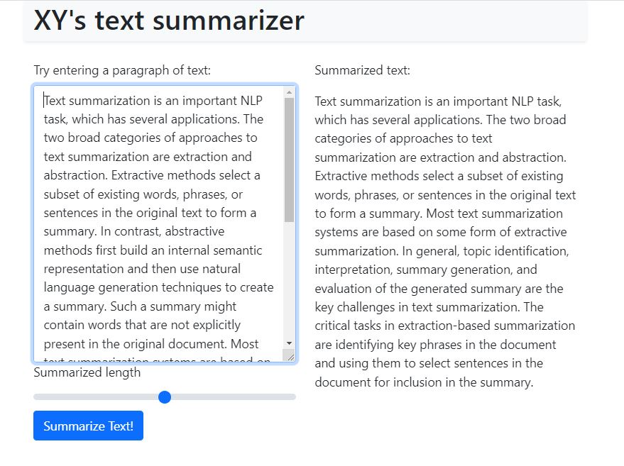

<!--
*** TBFilled
-->

<!-- PROJECT LOGO -->
 

  

  <h2 align="center">Text Summary</h2>

  

    Some subtitle
     
    <a href="#about-the-project"><strong>Explore the project »</strong></a>
     
     
    <a href="#about-the-project">View Demo</a>
    ·
    <a href="#">Report Bug</a>
    ·
    <a href="#">Request Feature</a>
  

 

<!-- ABOUT THE PROJECT -->
## About The Project

<blockquote>
Extractive Text summarization using BERT embedding and Page Rank Algorithm
</blockquote>

(<a href="#top">back to top</a>)

## Details
1. Transform long text into embeddings
2. Find cosine similarity between every pair of sentences, and store result in a graph
3. Apply page rank algorithm on graph
4. Get index of the top n sentences

<!-- GETTING STARTED -->
## Getting Started

Am too poor to host the service, so go build the docker image yourself. Thanks.
Update docker compose file for different pre-trained embedding model.

## Installation

`docker-compose up`

Go to http://0.0.0.0:5000/

(<a href="#top">back to top</a>)

<!-- MARKDOWN LINKS & IMAGES -->
<!-- https://www.markdownguide.org/basic-syntax/#reference-style-links -->
[contributors-shield]: https://img.shields.io/github/contributors/othneildrew/Best-README-Template.svg?style=for-the-badge
[contributors-url]: https://github.com/othneildrew/Best-README-Template/graphs/contributors
[forks-shield]: https://img.shields.io/github/forks/othneildrew/Best-README-Template.svg?style=for-the-badge
[forks-url]: https://github.com/othneildrew/Best-README-Template/network/members
[stars-shield]: https://img.shields.io/github/stars/othneildrew/Best-README-Template.svg?style=for-the-badge
[stars-url]: https://github.com/othneildrew/Best-README-Template/stargazers
[issues-shield]: https://img.shields.io/github/issues/othneildrew/Best-README-Template.svg?style=for-the-badge
[issues-url]: https://github.com/othneildrew/Best-README-Template/issues
[license-shield]: https://img.shields.io/github/license/othneildrew/Best-README-Template.svg?style=for-the-badge
[license-url]: https://github.com/othneildrew/Best-README-Template/blob/master/LICENSE.txt
[linkedin-shield]: https://img.shields.io/badge/-LinkedIn-black.svg?style=for-the-badge&logo=linkedin&colorB=555
[linkedin-url]: https://linkedin.com/in/othneildrew
[product-screenshot]: images/screenshot.png